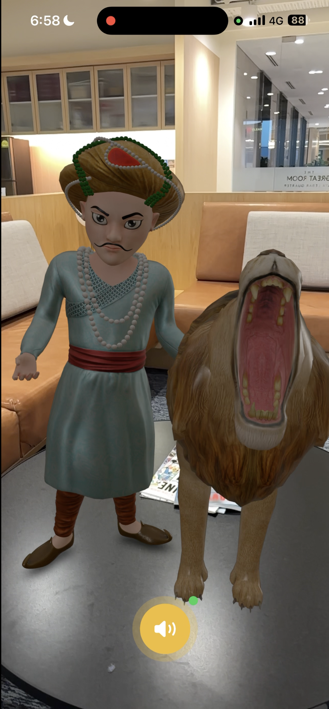

# 🦁 Utama AI

**Talk to history. In augmented reality.**

Built for the [Google Gemini API Developer Competition](https://ai.google.dev/competition) — 7 March 2026, Singapore.

Utama AI brings Singapore's founding legend to life. Point your iPhone at any surface and watch Sang Nila Utama — the 13th-century Srivijayan prince who named Singapore — materialize in AR alongside his legendary lion. Have a real-time voice conversation powered by Google's Gemini Live API, trigger a lion roar, and experience an immersive VR flashback to the moment that gave Singapore its name.

---

## Demo

[](https://www.youtube.com/watch?v=f3ol2L_EAtY)

---

## Features

- **AR Character Placement** — Sultan and lion appear on any detected surface via ARKit plane detection
- **Real-Time Voice Conversation** — Bidirectional streaming audio with Gemini Live API; the Sultan responds in character with his own voice
- **Skeletal Animation Sync** — Character animations driven by voice amplitude (talking, gesturing, idle states)
- **Lion Roar Trigger** — Say something about the lion and it roars on command
- **VR Flashback Scene** — Ask the Sultan to show you the lion encounter and the app transitions into an immersive VR cinematic with gyroscope tracking
- **Fully In-Character AI** — The Sultan stays in 13th-century persona, references the Malay Annals, and never breaks character

---

## Tech Stack

| Layer | Technology |
|-------|-----------|
| **Platform** | iOS (iPhone), Swift, SwiftUI |
| **AR/3D** | RealityKit + ARKit — plane detection, 3D character placement, skeletal animation |
| **AI Voice** | Google Gemini Live API (`gemini-2.5-flash-native-audio`) — real-time bidirectional voice over WebSocket |
| **Audio Pipeline** | AVAudioEngine — mic capture at 16kHz mono PCM, streamed playback at 24kHz with amplitude extraction |
| **3D Assets** | USDZ models rigged via Mixamo, exported from Blender 5.0.1 |
| **VR Cinematic** | SceneKit curved-screen renderer + CoreMotion gyroscope tracking |
| **Video Generation** | Google Veo 3.1 (VR flashback scene) |
| **Build** | Xcode 26.3, iOS SDK 26.2 |

---

## 📁 Project Structure

```
UtamaAI/
├── App/                  # App entry point, state machine coordinator
├── AR/                   # ARKit scene management, character loading & animation
├── Animation/            # Voice amplitude → animation sync
├── Voice/                # Gemini WebSocket client, mic capture, audio playback
├── VR/                   # VR scene player with gyroscope-tracked curved screen
├── UI/                   # SwiftUI views (AR overlay, subtitles, mic indicator)
├── Config/               # Character persona prompts, API key config
└── Assets/
    ├── Models/           # Base USDZ characters (Sultan + Lion)
    ├── Animations/       # 8 USDZ animation clips
    ├── Audio/            # SFX (roar, ambient, transitions)
    └── Video/            # VR flashback MP4
```

---

## Getting Started

### Prerequisites
- Xcode 26+ with iOS SDK
- iPhone with iOS 17.0+ (AR requires physical device)
- Google Gemini API key

### Setup
```bash
git clone https://github.com/pebblepaw/UTAMA_AI.git
cd UTAMA_AI
```

Create a `UtamaAI/Config/LocalSecrets.swift` file (gitignored):
```swift
import Foundation

enum LocalSecrets {
    static let geminiAPIKey = "YOUR_GEMINI_API_KEY"
}
```

Open `UtamaAI.xcodeproj` in Xcode, select your device, and run.

---

## The Story

In 1299, Prince Sang Nila Utama sailed from Palembang to the island of Temasek. During a hunting expedition, he spotted a magnificent creature — a lion. Inspired by this encounter, he named the island **Singapura** (Lion City), founding what would become modern Singapore.

Utama AI lets you stand face-to-face with the prince and hear the story in his own words.

---

## License

Built for the Google Gemini API Developer Competition. All 3D assets sourced from CGTrader with appropriate licenses.
